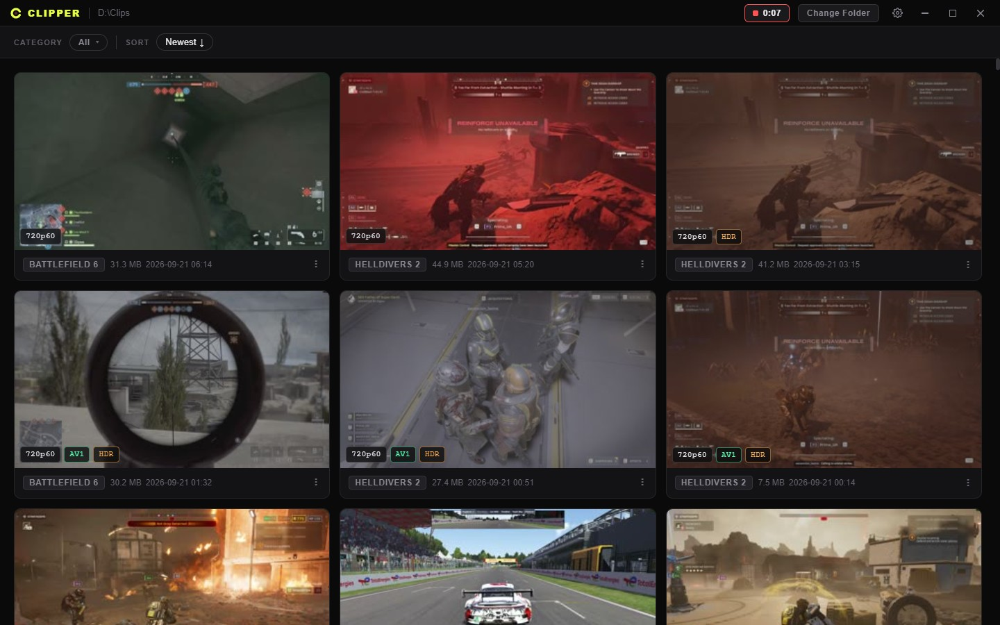
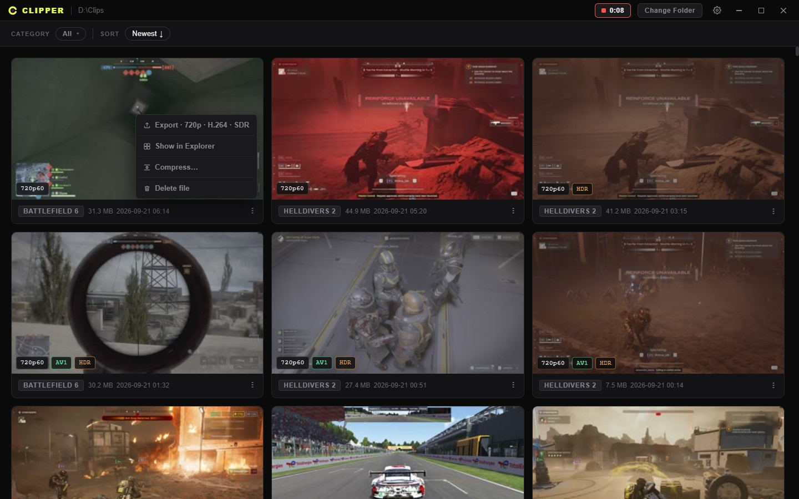
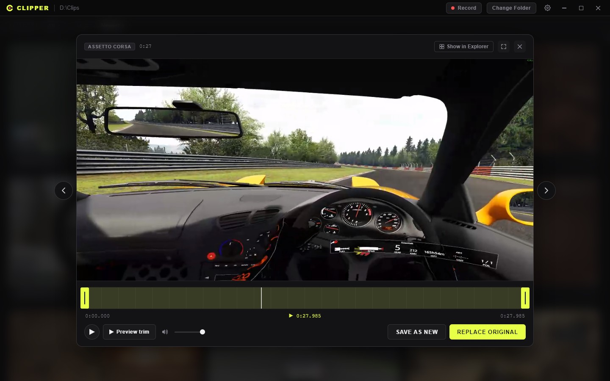
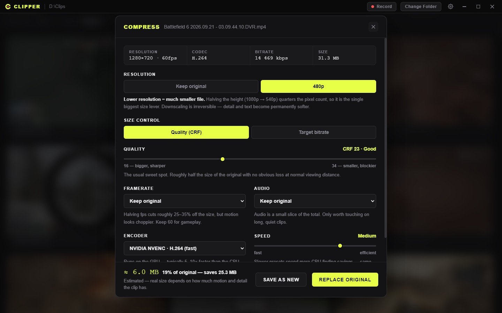
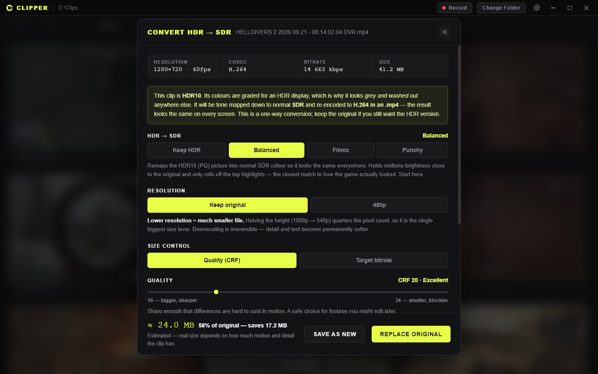
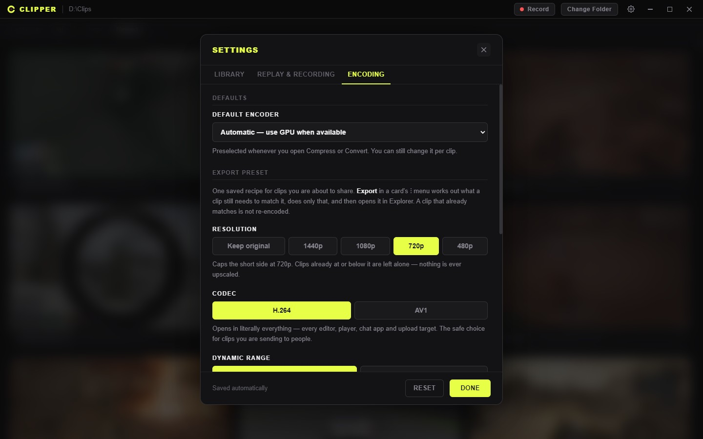
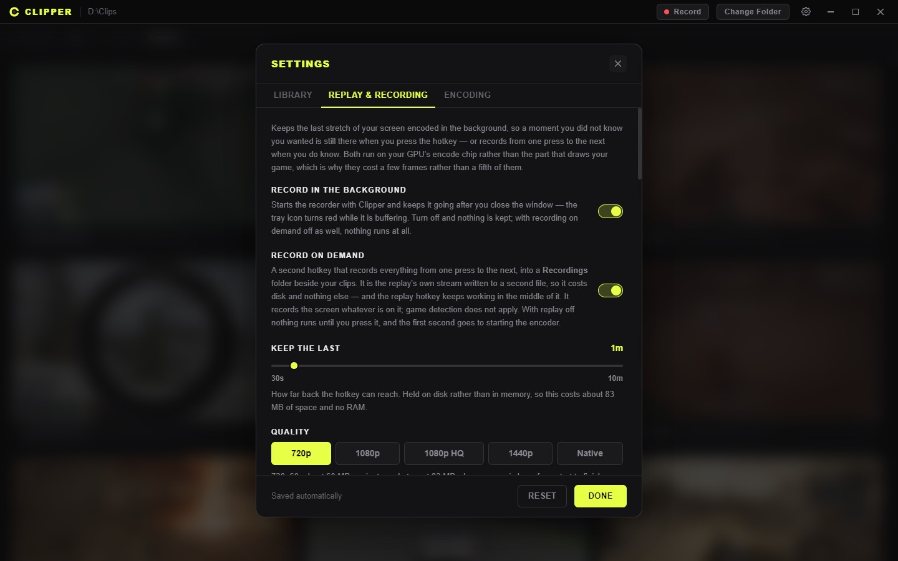
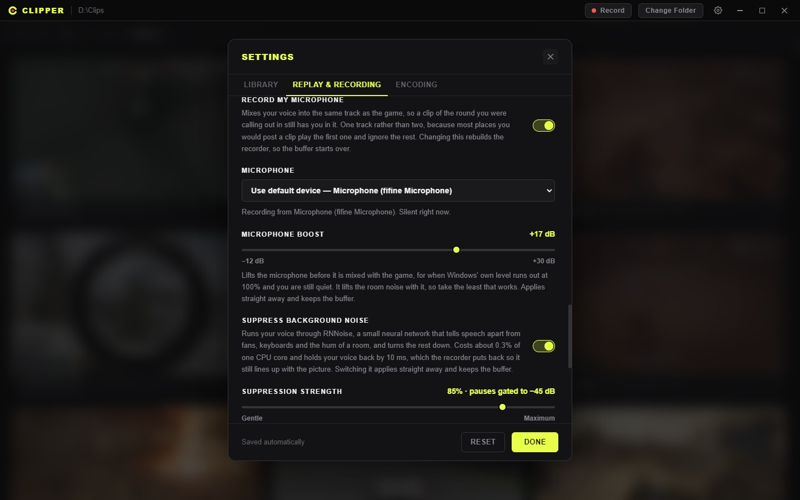
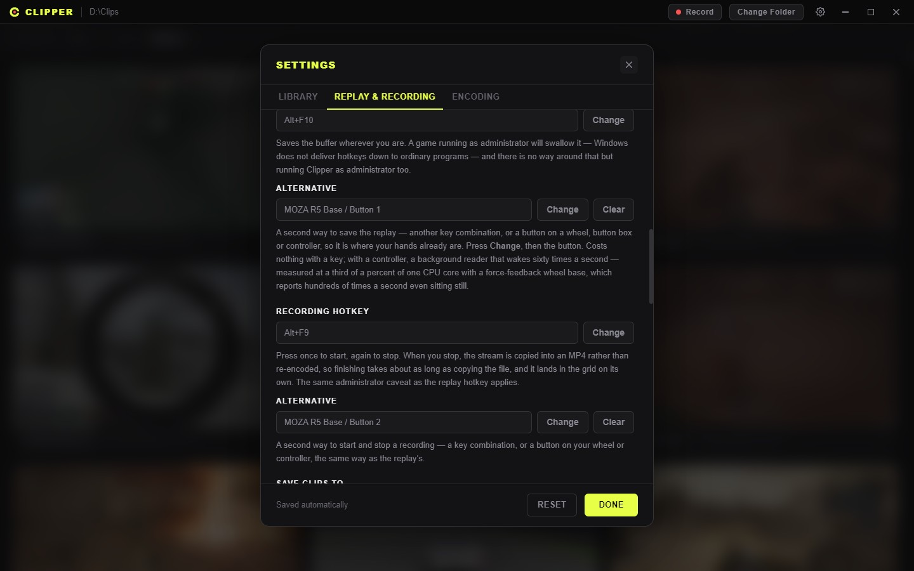

<div align="center">


# Clipper

**A clips folder you can actually live in — browse, trim, compress, share, and keep the last
minute of every game you play.**

Windows · Electron + ffmpeg · a Direct3D recorder in Rust

</div>

---

Clipper does two things. It is a **library** for the folder your game clips land in — a grid of real
thumbnails with quality badges, a trimmer that is lossless and instant, and one-click routes to the
shapes you actually send people. And it is an **instant replay recorder** that keeps the last stretch
of your screen buffered in the background, so the moment you did not know you wanted is still there
when you press the hotkey — and records from one press to the next when you do know.



Nothing here phones home, there is no account, and no clip leaves your disk unless you move it.

---

## Table of contents

- [Setup](#setup)
- [The library](#the-library)
- [Trimming](#trimming)
- [Compressing a clip](#compressing-a-clip)
- [Converting AV1 → MP4](#converting-av1--mp4)
- [Converting HDR → SDR](#converting-hdr--sdr)
- [Export preset](#export-preset)
- [Instant replay](#instant-replay)
  - [Buttons on your wheel](#buttons-on-your-wheel)
  - [Recording on demand](#recording-on-demand)
- [Settings](#settings)
- [Notes](#notes)
- [License](#license)

---

## Setup

**Requirements:** Windows 10/11 x64, and [Node.js](https://nodejs.org) v18+ if you are running from
source.

### Just want to use it

Grab the latest [release](../../releases). The installer and the portable `.exe` both carry
everything — ffmpeg and the recorder are bundled.

### Running from source

```bash
git clone <this repo>      # with Git LFS installed — see the warning below
cd clipper
npm install
npm start
```

> **ffmpeg.exe is tracked in Git LFS** (~130 MB). A clone made without LFS installed gets a pointer
> file instead of a binary, and every single ffmpeg call fails with a confusing error. If you did
> that already: `git lfs install && git lfs pull`.
>
> You can also drop your own `ffmpeg.exe` into `ffmpeg-bin/`, or install one system-wide
> (`winget install ffmpeg`) — Clipper falls back to `PATH`.

The recorder (`capture-bin/clipper-capture.exe`) ships prebuilt. To rebuild it you need a Rust
toolchain:

```bash
cd capture && cargo build --release
cp target/release/clipper-capture.exe ../capture-bin/
```

### Building a distributable

```bash
npm run build            # NSIS installer + portable .exe, into dist/
npm run build-portable   # portable .exe only
```

---

## The library

Point Clipper at the folder your clips land in. **Subfolders become categories** — which is exactly
how the instant replay recorder files them, so a library sorted by game costs you nothing.

Every card shows a real frame from the clip, not a generic icon, and a **quality badge** in the
corner: `1080p60`, `720p`, `4K`. The badge is named after the clip's *short* side, so portrait clips
read correctly instead of claiming to be 4K. Clips encoded with AV1 get an extra green **AV1** badge,
and HDR clips get an orange **HDR** (or **HLG**) one — so you can see, before opening anything, which
files are going to give somebody trouble.

- **Hover a card** and it plays in place. Turn it off in Settings if scrolling a big folder feels heavy.
- **Filter by category**, with a search box once you have more games than fit on screen.
- **Sort** newest or oldest first.
- **Delete several at once.** A card's **⋮** menu → **Select** puts a checkbox on every card; click
  anywhere on a card to tick it, then **Delete** from the bar at the top. It shows how much the
  selection frees before you commit, and **Esc** backs out.
- **The folder is watched.** A clip saved by the recorder — or by anything else — shows up without a
  refresh, and a file *rewritten in place* has its card rebuilt: new still, new badges, new size.



The still and the metadata come from a single ffmpeg pass per clip, so the badges cost nothing on top
of the thumbnail you were getting anyway. Both are lazy, driven by what is actually on screen.

---

## Trimming

Click a clip to open it.



1. Drag the **yellow handles** on the timeline to set the in and out points
2. **Preview trim** plays just the selection
3. **Save as new** writes a new file; **Replace original** overwrites in place

Trimming is a **stream copy** — no re-encode, so it is near-instant and completely lossless. The one
cost: cuts land on keyframe boundaries, so the start can be off by a fraction of a second. That is how
video works, not a bug.

| Key | |
| --- | --- |
| `←` `→` | previous / next clip, without leaving the player |
| `F` | fullscreen |
| `M` | mute |
| `Esc` | close |

---

## Compressing a clip

A card's **⋮** menu → **Compress…**. The modal opens with the clip's current resolution, codec,
bitrate and size in front of you, and gives you:

- **Resolution** — keep it, or drop down the ladder to 1440p / 1080p / 720p / 480p. Only rungs *below*
  the source are offered; upscaling has never saved anybody space.
- **Size control** — *Quality (CRF)* to target a look and let size fall where it may, or *Target
  bitrate* to land under a hard upload limit.
- **Framerate**, **audio** (keep / re-encode / strip), and **encoder speed**.
- **Encoder** — your GPU when it has usable silicon, with CPU x264/x265 always available.



Every control carries a one-line note on what moving it does to the picture, and the footer shows a
live **estimated output size** against the original. The estimate is a model, not a promise — real
size depends on how much motion the clip has.

---

## Converting AV1 → MP4

**Convert to MP4…** only appears for clips that are actually AV1. For anything else it would be a
lossy round-trip with nothing gained, so it is not offered.

It re-encodes to **H.264 in an .mp4**, which every editor, player and upload target accepts. AV1 clips
usually get *larger* — that is the price of compatibility, and the modal says so before you start.

---

## Converting HDR → SDR

Capture on an HDR display records the clip in HDR, graded against a PQ or HLG curve and the wide
bt2020 gamut. Anything that is not an HDR screen ignores that grading and shows the raw values, which
is why the clip looks **grey, flat and washed out** the moment you send it to a friend. Re-encoding
alone does not fix it — the picture has to be converted.

**Convert HDR → SDR…** takes the picture back to linear light, maps bt2020 → bt709, compresses the
brightness into SDR range, and re-encodes to H.264 **correctly tagged bt709** so nothing downstream
second-guesses it. That last part matters: without the re-tag, ffmpeg copies the source's colour tags
and the result still claims to be HDR.



| Mode | What it does |
| --- | --- |
| **Keep HDR** | Leaves the dynamic range alone. Stays HDR — and stays grey on SDR screens. |
| **Balanced** | Holds midtone brightness close to the original and rolls off only the top highlights. The closest match to how the game looked, and the default. |
| **Filmic** | Filmic S-curve that protects detail in skies, explosions and muzzle flashes, at the cost of darkening the whole picture. |
| **Punchy** | Leaves everything below SDR white exactly as graded and hard-clips above it. Most contrast, no highlight detail. |

The same control appears in **Compress** whenever the source is HDR, switched on by default —
compressing an HDR clip to 8-bit without tone mapping is precisely what produces the washed-out
result. Tone mapping needs an ffmpeg with the `zscale` filter (libzimg); builds without it say so
rather than silently doing nothing.

All three actions offer **Save as new** (`clip_720p.mp4`, `clip_h264.mp4`, `clip_sdr.mp4` next to the
original) and **Replace original**. Long encodes show progress with speed and time remaining, and can
be cancelled — a cancelled run leaves nothing behind.

---

## Export preset

The other actions each answer one question. **Export** answers the whole thing: *get this clip into
the shape I send people, and open it.*

Set the recipe once — resolution cap, codec, dynamic range, quality, new file or replace. After that,
**Export** carries the preset in its menu label (`Export · 1080p · H.264 · SDR`), so you know what it
will do before you click it.

What makes it worth having is what it *doesn't* do:

| The clip | What actually happens |
| --- | --- |
| Already matches in every way | Nothing is re-encoded. Revealed in Explorer as-is (or copied, if the preset saves a new file). |
| Only the container is wrong (`.mkv`, `.mov`) | Repackaged to `.mp4` with `-c copy`. Bit-for-bit the same video, in about a tenth of a second. |
| Needs a downscale, a codec change, a tone map, or any mix of them | **One** ffmpeg pass doing all of it at once. |

That last row is the important one: chaining separate encodes would stack generation loss to arrive at
exactly the same frames, so scaling, tone mapping and the codec change all happen in a single pass.

Turn on **Ask before every export** and you get the options each time, along with the exact plan:

```
FOR THIS CLIP
  →  Re-encode AV1 → H.264
  →  Tone map HDR → SDR (Balanced)
  ·  Already 720p — not upscaling to 1080p
```

Lines with `→` are work that will happen; lines with `·` are things deliberately skipped.

**Codec choice.** **H.264** opens in literally everything and is the right default for clips you are
sending to people. **AV1** produces distinctly smaller files at matched quality, and on a GPU with an
AV1 encoder (RTX 40-series and newer, Arc, RDNA3) it is fast too — Clipper probes for `av1_nvenc`,
`av1_qsv` and `av1_amf` and falls back to SVT-AV1 on the CPU. The catch is support: older phones,
browsers and editors will not open it.

Resolution is a **cap**, not a target. A 720p clip under a 1080p preset is left alone.



---

## Instant replay

Turn on **Record in the background** in Settings and Clipper keeps the last stretch of your screen
encoded in a ring buffer. Press the hotkey — `Ctrl+Alt+F12` by default, rebindable — and that stretch
becomes a clip in your library. The tray icon turns red while the buffer is live, and so does the dot
in the titlebar mark.



It is a native Direct3D 11 recorder, not ffmpeg. Frames are captured, scaled, tone mapped and packed
to NV12 in **one GPU pass**, then encoded by your card's dedicated encode silicon through Media
Foundation — NVIDIA, AMD or Intel, whichever you have. Nothing but the compressed bytes ever touches
system memory. The cost is a few frames per second, not a fifth of them.

**It knows what a game is.** In *Only in games* mode the pipeline only exists while a game actually
has focus, so reading email does not burn encode time or trickle writes to your disk. "Fullscreen" is
not the test — a maximised terminal, a chat window someone pressed F11 in and a full-screen browser
are all fullscreen and none of them is a game. Instead the question is asked in layers: your own
include/exclude lists first, then a built-in list of things that are never games, then Windows' own
Game Bar registry, then sustained 3D load on the GPU. The Settings panel shows you what it thinks is
in front right now, with **Treat as a game** / **Never a game** buttons when it gets one wrong.

**It knows what the game is called.** A folder named `RuntimeClient-Win64-Shipping` is not a library
sorted by game, so the name is read from wherever a human already wrote it down — Game Bar's registry,
the Store, the executable's own version info — rather than guessed from the filename. With **a folder
per game** on, clips file themselves into categories Clipper already reads. Anything that is not a
game goes to one shared **Desktop** folder rather than getting a folder of its own.

| Setting | What it costs |
| --- | --- |
| **Keep the last** | 30 s to 10 minutes. The buffer lives on disk, not in RAM — a minute at 1080p HQ is about 150 MB of rolling writes, which is nothing for an SSD and would be a real cost in RAM. |
| **Quality** | 720p60 / 1080p60 / **1080p HQ** / 1440p60 / native. The panel quotes megabytes-per-minute for each, because that is the number you recognise from your clips folder. |
| **Screen** | Which display to record. |
| **When to record** | Only in games, or always. |
| **Desktop audio** | Everything your PC plays, on every output — the game on your speakers and a call on your headset both end up in the clip. Clipper's own sounds are left out, so the save chime and clips you preview never do. About 24 KB/s. |
| **Microphone** | Mixed into the *same* track as the game, with an optional boost for when Windows' own level runs out at 100%. One track, because most places you post a clip play the first one and silently ignore the rest. |
| **Tell me when a clip is saved or a recording starts** | A silent Windows toast. The hotkey gets pressed while you are looking at a game, where Clipper's own toast is somewhere behind it. A recording announces its start too, because the hotkey toggles and nothing else over a game says which way it went. |
| **Play a sound when a replay is saved** | On by default. Plays once the file is written — about a twentieth of a second after the press — so hearing it means the clip exists. Pick **Chime**, **Pop** or **Sparkle**; all three are mastered to the same loudness, a little under typical game audio. It never ends up in a clip: the recorder leaves Clipper's own sounds out. |



**It stays up.** A display switched to HDR, a monitor turned off to spare an OLED, a resolution
change, a driver hiccup — none of those is an error worth quitting on. Each one rebuilds the pipeline
and carries on. Almost every setting applies without a restart, because a restart drops the ring, and
losing the last minute of footage to a slider is a bad trade.

**The recorder is a child process** of Clipper and exits with it, so there is no way to end up with an
orphan quietly writing to your disk. In Task Manager it appears nested under Clipper as *Clipper
Instant Replay*.

**Any combination, and it tells you if it is taken.** Press **Change** and then the keys you want —
including the ones a settings window normally cannot see, like `Alt+F10`, because the recorder does
the listening rather than the app window. Windows hands out a global hotkey to one program at a
time, so if something else already holds the combination the field says so outright instead of
quietly never firing. NVIDIA's overlay holds `Alt+F9` and `Alt+F10` on most gaming machines; Steam,
Discord and Xbox Game Bar each claim a few more.

> **One known limitation, with no fix from user space:** Windows never delivers a hotkey to an
> ordinary program while something running as administrator has focus. A game launched elevated, or
> one whose anti-cheat runs elevated, will swallow the combination silently. Running Clipper as
> administrator too is the only way around it.

### Buttons on your wheel

Each hotkey has an **Alternative** bind underneath it, and that one can be a button on a sim racing
wheel, a button box, a flight stick or a gamepad — anything Windows calls a game controller — as
well as a second key combination. Press **Change**, then the button. Your hands are on the wheel
when the moment happens; reaching for `Ctrl+Alt+F12` mid-corner is not a thing anybody does.



Buttons and the D-pad on the rim both work, read from the device's own description of itself, so it
is not a list of supported wheels. A bind remembers the device by its make and model, so it still
works after you unplug the wheel or move it to another port, and the field says so if the device is
not connected. The main hotkeys stay keyboard-only, so there is always one bind that works with
nothing plugged in.

It costs nothing until you bind a button. With one bound, a background reader runs: a
force-feedback wheel base reports its position hundreds of times a second even sitting still, so the
reader drains those in batches sixty times a second instead of waking for each. Measured with a MOZA
R5 base: about a third of a percent of one CPU core.

### Recording on demand

Turn on **Record on demand** and a second hotkey — `Alt+F9` by default, ShadowPlay's own — records
everything from one press to the next. The recording lands in a **Recordings** folder inside your
clips folder, which the grid shows as a category of its own. The **Record** button in the titlebar
does the same thing and counts the time while it runs.

**It is the replay's own stream, written twice.** The recorder already encodes your screen once for
the buffer; a recording takes a copy of those same packets on their way to it. So it costs no GPU at
all beyond what the replay already spends, it is at exactly the replay's quality, screen and audio
mix without a second set of settings to keep in step, and **the replay hotkey keeps working in the
middle of a recording** — press it an hour in and you still get the last minute as a clip.

It records the screen, not the game. *Only in games* and the folder-per-game sorting belong to the
replay; a recording you started runs until you stop it, whatever is in front. With replay off, the
recorder sits idle until you press the hotkey, and the first second goes to starting the encoder.

**Nothing is lost if something goes wrong.** While it runs, a recording is a `.ts` stream that is
valid up to its last byte; stopping copies it into an MP4 — no re-encode, so it takes about as long
as copying the file. If the recorder is killed or the machine loses power mid-recording, the next
start finishes the file it left. A display switched to HDR or turned off for a moment does not end
the recording either: it waits for the screen, then carries on in the same file with the gap closed.
Only a change the file cannot carry — a different resolution, audio switched on or off — starts a
new one.

---

## Settings

The **⚙** button in the titlebar. Everything saves as you change it.

### Library

| Setting | What it does |
| --- | --- |
| **Font size** | Scales every label, button and tip, 80%–140%, with a live preview. Icons and window chrome stay fixed so nothing gets clipped. |
| **Card size** | How wide a card gets before the grid wraps — Small / Medium / Large / Huge. |
| **Play preview on hover** | Turn off if scrolling a large folder feels heavy. |
| **Thumbnail frame** | Which second of each clip to grab its still from. Bump it up if your clips open on a black intro or a loading screen. |
| **Start with Windows** | Launches Clipper when you sign in, straight to the tray — no window. Worth it with instant replay on, since the buffer only reaches back as far as the recorder has been running. |

### Replay & recording

All of the above — see [Instant replay](#instant-replay) and [Recording on demand](#recording-on-demand).

### Encoding

| Setting | What it does |
| --- | --- |
| **Default encoder** | Preselected whenever you open Compress or Convert. *Automatic* prefers your GPU when one is usable. Still overridable per clip. |
| **Export preset** | The saved recipe **Export** uses. Editing it here takes effect immediately. |
| **Ask before every export** | Shows the preset options on every export, with the plan for that clip. Off by default. |

---

## Notes

- **Supported formats:** anything ffmpeg opens — `.mp4`, `.mov`, `.avi`, `.mkv`, `.webm`, `.wmv`,
  `.flv`, `.m4v`, `.mts`, `.m2ts`.
- **Closing the window does not stop the recorder.** That is the entire point of a replay buffer. The
  tray icon is the way back, and **Quit Clipper** in its menu is how you actually stop everything.
  With instant replay and recording on demand both off, closing the window quits normally.
- **Closed to the tray, the window costs nothing.** It is hidden rather than thrown away, so reopening
  is instant and your thumbnails are still there — but it stops drawing entirely while it is out of
  sight, and a clip left playing is paused. Measured at 0% of the GPU, the same as if it were not
  running at all. What is left on the meter is the recorder, which is the part doing the work.
- **Hardware encoders are probed by doing, not by asking.** An `-encoders` listing only proves the
  ffmpeg build has the encoder, not that your machine has the silicon — so Clipper runs a throwaway
  one-frame encode per candidate at startup and offers only what actually worked.
- **HDR is detected by transfer curve** (`smpte2084` for HDR10, `arib-std-b67` for HLG), not by bit
  depth or gamut. A 10-bit bt2020 clip with an ordinary curve is wide-gamut, not HDR, and is left
  alone.
- **Tone mapping is one-way.** The SDR copy cannot be turned back into HDR. Keep the original if you
  still want the HDR version.
- **Export never re-encodes to reach a state the clip is already in.** Repackaging a container and
  copying a file are both lossless; only an actual change to the picture costs quality.

---

## License

**[PolyForm Noncommercial 1.0.0](LICENSE)** — use it, copy it, change it, share it, build on it, all
for free, for any noncommercial purpose. Personal use, hobby projects, study and research are
explicitly covered, as are charities, schools, public research bodies and government institutions.

**Commercial use is not granted.** If you want to use Clipper, or code from it, in or for a business,
open an issue and ask.

That restriction is the reason this is *source-available* rather than *open source* in the OSI sense —
the OSI definition does not permit a field-of-use limit, so GitHub will not show a license badge for
it. That is the intended trade, not an oversight.

The license covers Clipper's own source only. The third-party pieces keep their own terms, and the
important one is **ffmpeg**: `ffmpeg-bin/ffmpeg.exe` is a prebuilt full build, which includes GPL
components, so that binary is **GPLv3**. Clipper runs it as a separate program over the command line
and links nothing against it. See the THIRD-PARTY section at the bottom of [LICENSE](LICENSE) for the
full list.
